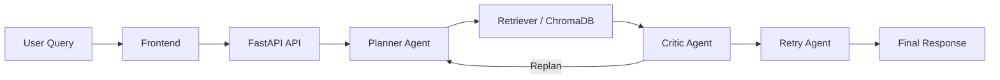
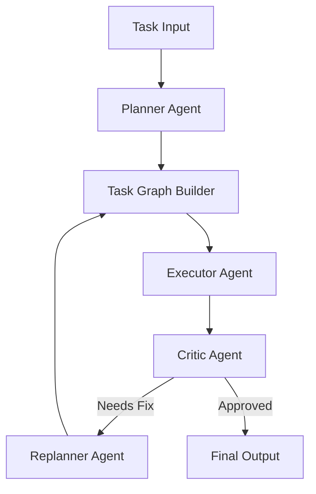

  
  
  
  

  

<h1 align="center">Sanjay J</h1>

  <strong>AI Engineer | Agentic AI Developer | RAG Systems Builder | FastAPI Backend Engineer</strong>

  I build production-grade AI systems that think, retrieve, reason, and execute with reliability. My work sits at the intersection of <strong>Agentic AI</strong>, <strong>RAG</strong>, <strong>LLM orchestration</strong>, and <strong>backend engineering</strong>.

---

## About Me

I am an AI Engineer with hands-on experience building intelligent, production-oriented systems through internships and personal projects. My focus is on creating:
- Agentic AI applications with multi-step reasoning and tool use
- Retrieval-Augmented Generation systems grounded in real data
- FastAPI-based backend services for AI products
- Containerized and deployable AI infrastructure

I care deeply about building systems that are not just impressive in demos, but robust enough to ship and scale.

### What I specialize in
- Multi-agent workflows and orchestration
- LLM-powered applications
- Semantic retrieval and vector search
- Backend APIs and service architecture
- AI deployment pipelines and containerization

---

## Tech Stack

  
  
  
  
  
  
  
  
  
  

---

## Featured Projects

### Aetherion — Agentic Multi-LLM RAG System
Live: [https://agentic-rag-gamma.vercel.app](https://agentic-rag-gamma.vercel.app/)

A production-style AI experience combining retrieval, multi-agent reasoning, and LLM orchestration to deliver smarter, more reliable answers.

- Multi-LLM orchestration
- ChromaDB semantic retrieval
- Planner agent
- Critic agent
- Retry agent
- Bounded self-correction
- FastAPI backend
- Docker deployment

<strong>Architecture Snapshot</strong>

---

### Dragonite — Graph-Based AI Agent Framework
Repo: [https://github.com/kcsanjayj/Dragonite](https://github.com/kcsanjayj/Dragonite)

A framework for graph-based AI workflows where tasks are decomposed and executed through specialized agents.

- Graph-based task DAG execution
- Planner agent
- Executor agent
- Critic agent
- Replanner agent
- Parallel task execution
- Multiple LLM providers
- FastAPI orchestration services

<strong>System Flow</strong>

---

## Experience

- <strong>Planning Engineer (Data & Operations)</strong> — Corrtech International Ltd. 
  Apr 2025 – Mar 2026

- <strong>Machine Learning Intern</strong> — Tringapps Research Labs 
  Jan 2024 – Mar 2024

---

## Education

- <strong>B.E. Computer Science and Engineering</strong> 
  K. Ramakrishnan College of Technology 
  2020 – 2024

---

## Certifications

- Develop a RAG-based Solution with your own data using Microsoft Foundry
- Develop an AI Agent with Microsoft Foundry Agent Service
- Orchestrate a Multi-Agent Solution Using the Microsoft Agent Framework

---

## GitHub Analytics

  
  

  

  

  

  

---

## Connect With Me

  
  
  

  <strong>Open to opportunities in AI Engineering, Applied AI, GenAI, and Backend Engineering.</strong>

