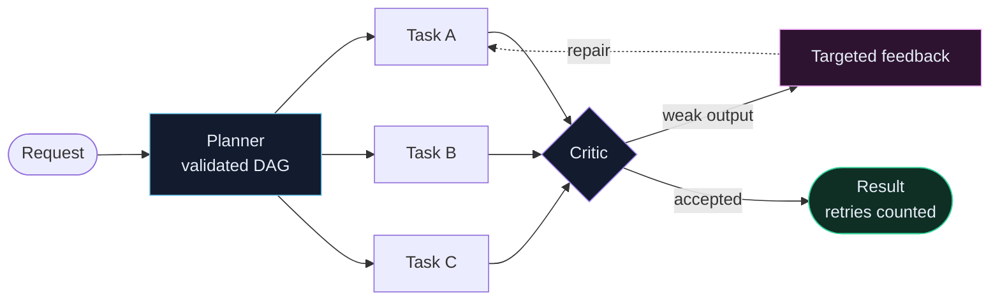

 

 

## ⚡ In one breath

I build LLM systems that **fail visibly and recover on purpose**: validated plans, critics that review output, bounded retries and budgets, and evals that say plainly what they do *and don't* prove.

Early-career, and I learn each layer from first principles: build it, test it, document its limits.

 

## 📊 By the numbers

| **63** | **26** | **87** | **13.9M** | **6.05** |
|:---:|:---:|:---:|:---:|:---:|
| Rust tests in rapTOR | deterministic e2e evals | tests in Spaghetti | params, trained from scratch | val. perplexity on TinyStories |

 

## 🚀 Selected Projects

### 🦀 [rapTOR](https://github.com/kcsanjayj/rapTOR) · Multi-agent orchestrator

```mermaid
flowchart LR
    R([Request]) --> P[Planner<br/>validated DAG]
    P --> A[Task A]
    P --> B[Task B]
    P --> C[Task C]
    A --> K{Critic}
    B --> K
    C --> K
    K -- weak output --> F[Targeted feedback]
    F -.repair.-> A
    K -- accepted --> O([Result<br/>retries counted])
    style P fill:#131c2e,stroke:#7dd3fc,color:#e6edf7
    style K fill:#131c2e,stroke:#a78bfa,color:#e6edf7
    style O fill:#0f2e24,stroke:#34d399,color:#e6edf7
    style F fill:#2e1330,stroke:#f0abfc,color:#e6edf7
```

Plans a request into a validated dependency graph, runs independent tasks in parallel, reviews each result with a critic, and repairs weak output with targeted feedback. Runs fully offline against a local model or a seeded simulator with fault injection.

- ✅ 63 Rust tests and 26 deterministic end-to-end evals, in CI on Ubuntu and Windows
- 🔁 Rewritten after a self-review found eight defects; each now has a regression test
- 🪶 Four direct dependencies; plan validator, calculator and parsers are hand-written and bounded

`Rust` `Python` `GitHub Actions` `Ollama`

 

### 📚 [Spaghetti](https://github.com/kcsanjayj/Spaghetti) · Local document Q&A (RAG)

Ask questions over PDF, DOCX and text files using a model on your own machine: streaming answers with citations, no cloud, no API keys. [Live UI](https://spaghetti.kcsanjayj.workers.dev) *(chat needs the local backend)*.

- 🎯 Relevance threshold chosen by ablation: abstention up from 0.8 to 1.0, no loss in retrieval
- ⚙️ Rust core for chunking and ranking, with a pure-Python twin and parity tests
- ♿ 87 tests, a 28-case eval harness, zero axe-core accessibility violations

`Python` `Rust` `JavaScript` `BM25` `Ollama`

 

### 🧠 [TinyGPT-X](https://github.com/kcsanjayj/TinyGPT-X) · A language model from scratch

A 13.9M-parameter decoder-only transformer in PyTorch, trained from random init on a single 6 GB laptop GPU in about 11 minutes. Published on the [Hugging Face Hub](https://huggingface.co/kcsanjayj/TinyGPT-X) in GPT-2 format.

- 📉 Validation perplexity 6.05 on TinyStories
- 🔬 Exported logits verified against the native implementation
- 🧪 Tests for causality, attention equivalence and export parity

`PyTorch` `Python` `Hugging Face`

 

## 🧭 How I work

| Principle | In practice |
|---|---|
| 👁️ **Make failure visible** | Retries are counted, partial results labelled, call budgets capped. |
| 🧪 **Test the machinery** | Simulators and fault injection make recovery reproducible. |
| 📏 **State the limits** | Every README says what its evals prove, and what they don't. |

 

## 🛠️ Toolbox

 

## 🔭 Currently

- Evaluating rapTOR against local models and tuning planner prompts
- Adding embedding-based retrieval to Spaghetti behind its existing ranking interface

 

### 🟢 Open to AI and ML engineering roles

<a href="mailto:kcsanjayj@gmail.com">kcsanjayj@gmail.com</a> · <a href="https://linkedin.com/in/kcsanjayj">linkedin.com/in/kcsanjayj</a>

